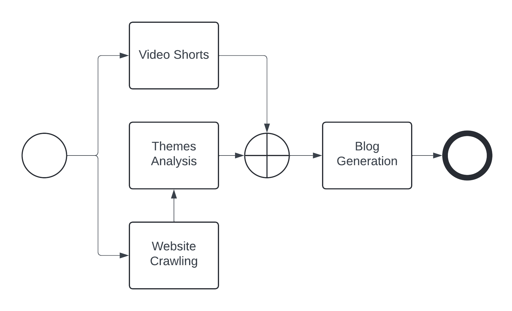

Project Overview
################

The Video Shorts Generator (VSG) is a comprehensive solution for creating video and blog content tailored to specific brands. This project leverages technologies, including Natural Language Processing (NLP), video analysis, and generative AI, to streamline the video creation process and deliver relevant and captivating video shorts.

At its core, the VSG project consists of several modules to achieve its objectives.

.. _vsg_structure:

Project Structure
=================

The VSG project follows a modular architecture, making it easy to understand and maintain. The codebase is organized into different modules, each responsible for specific functionalities. The main modules include:

1. *vsg_themes*: This module utilizes Natural Language Processing (NLP) techniques to analyze and extract information from a brand's website. It structures the gathered data into coherent themes, providing a foundation for video content creation.

2. *vsg_clips*: This module is designed to extract relevant clips from a given YouTube video. It analyzes the video content and identifies key segments that align with the themes extracted by the vsg_themes module.

3. *vsg_gen*: This module leverages generative AI technology to create blog content based on the extracted themes and video clips. It generates engaging and informative text that complements the visual content, offering a comprehensive storytelling experience.

4. *vsg_previewer*: A simple yet functional tool that allows users to preview the functionality of the VSG codebase. It provides a visual interface to explore the generated themes, video clips, and blog content, enabling users to evaluate and refine the output before finalizing the video production.

The modular structure of the VSG project ensures scalability, maintainability, and ease of collaboration. Each module can be developed and tested independently. The mono-repository structure allows an easier evolution of the project as a whole.

.. _vsg_models:

Video Shorts Generator: Models
##############################

Video Shorts Generator: Themes Extraction
=========================================

The *vsg_themes* module leverages Natural Language Processing (NLP) techniques to analyze and extract information from a brand's website. It structures the gathered data into coherent themes, providing a foundation for video and blog content generation.

The core logic of this module follows a systematic process:

1. *Website Crawling*: The module initiates a call to the brand's website, fetching the relevant HTML content from a given URL.

    .. py:method:: vsg_themes.extract.from_web.get_data_from_url_and_save_to_file

2. *Parsing and Data Extraction* : The retrieved HTML is parsed, and the textual content is extracted, producing a structured JSON file containing the website's information.

    .. py:method:: vsg_themes.extract.from_web.load_json_data

3. *NLP Processing*: The JSON file is then processed using NLP techniques, such as keyword extraction. These techniques identify and extract relevant keywords or themes present in the website's content.

4. *Theme Organization*: We extended the extracted keywords to organized and structured into a coherent format, facilitating their integration with the subsequent stages of the video creation pipeline.

Themes Extraction: algorithms
-----------------------------
We have opt to explore two approaches: TF-IDF and Lexical Chains.

1. TF-IDF Analysis: As a first step, the module employs the Term Frequency-Inverse Document Frequency (TF-IDF) algorithm to identify the most relevant and distinctive terms within the URL content. This approach helps to prioritize and weight the importance of various keywords and phrases.

   .. autoclass:: vsg_themes.analysis.keywords.Keywords
        :members:

2. Lexical Chains: which are sequences of related words and concepts that capture the coherence and semantic relationships within the text, where compiled by creating a graph of word similarity across the document extracted from the URL. This approach helps to group related keywords and themes together, providing a more comprehensive understanding of the website's content.

   .. autoclass:: vsg_themes.analysis.lexical_chain.LexicalChains
        :members:

VSG Clips
=========

For the clips generation module, we resort to the ClipsAI framework available on GitHub. This open-source library allowed us to accelerate quite significantly the development time in providing a good and accurate set of clips for a given video.

The ClipsAI framework is a powerful tool specifically designed for video analysis and clip extraction. By integrating ClipsAI into our vsg_clips module, we were able to benefit from its capabilities

   .. autoclass:: vsg_clips.generator.snippets_generator.SnippetsGenerator
        :members:

VSG Blog Generation
===================

The *vsg_gen* module is responsible for generating engaging blog content based on the extracted themes, video clips, and website information. This module harnesses the power of generative AI models (we currently only support Mixtral-8x7b to create informative and captivating text that complements the visual elements of the video shorts, resulting in a cohesive storytelling experience.

   .. autoclass:: vsg_gen.blog.llm_article.BlogGenerator
        :members:

.. _vsg_architecture:

Video Shorts Generator: Workflow
################################

This figure illustrates the end-to-end workflow of the Video Shorts Generator (VSG) project. It depicts the various interconnected modules and their respective functions, highlighting the seamless integration of different technologies to create engaging video shorts and complementary blog content tailored to specific brands.

    Figure: Workflow of the Video Shorts Generator (VSG)

